# Event permit rule diagrams

Generated from `backend/app/engine/rules.yaml`. Do not edit by hand;
regenerate with `cd backend && python -m app.engine.diagrams`.

Diamonds are questions, hexagons are macros (each drawn further down), and
boxes are rules, colored by kind. Dashed `before` edges mean one approval
must come first (group requirements such as `property_permission` are not
drawn); `then` edges hang rules that depend on another rule applying. A
diamond with several `yes` edges means every branch is checked.

## 00 · Overview

[`00_overview.mmd`](00_overview.mmd)

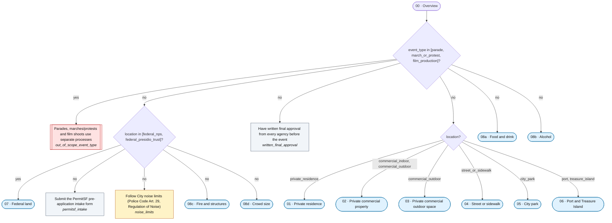

## 01 · Private residence

[`01_private_residence.mmd`](01_private_residence.mmd)

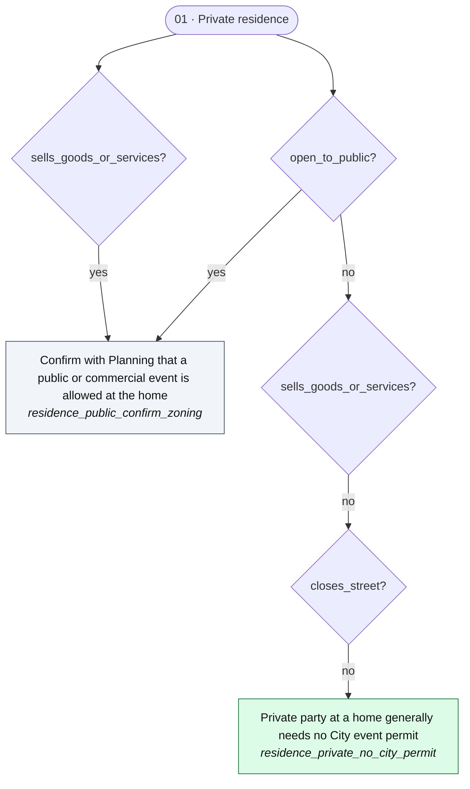

## 02 · Private commercial property

[`02_private_commercial_property.mmd`](02_private_commercial_property.mmd)

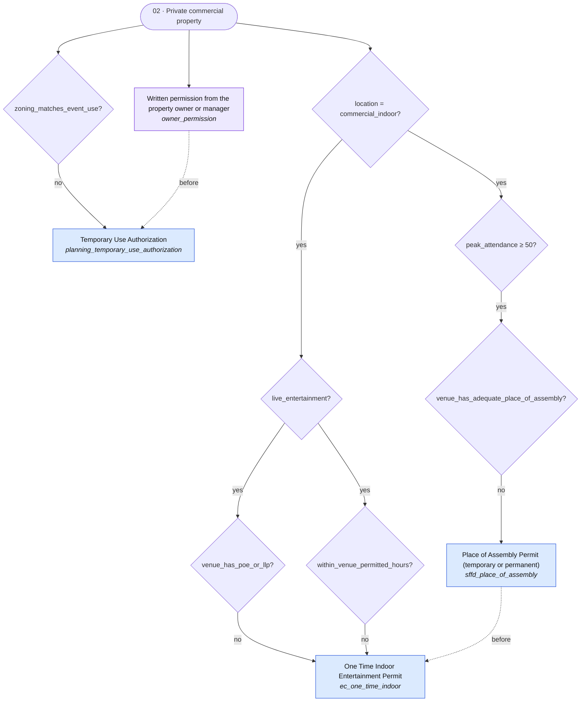

## 03 · Private commercial outdoor space

[`03_private_commercial_outdoor_space.mmd`](03_private_commercial_outdoor_space.mmd)

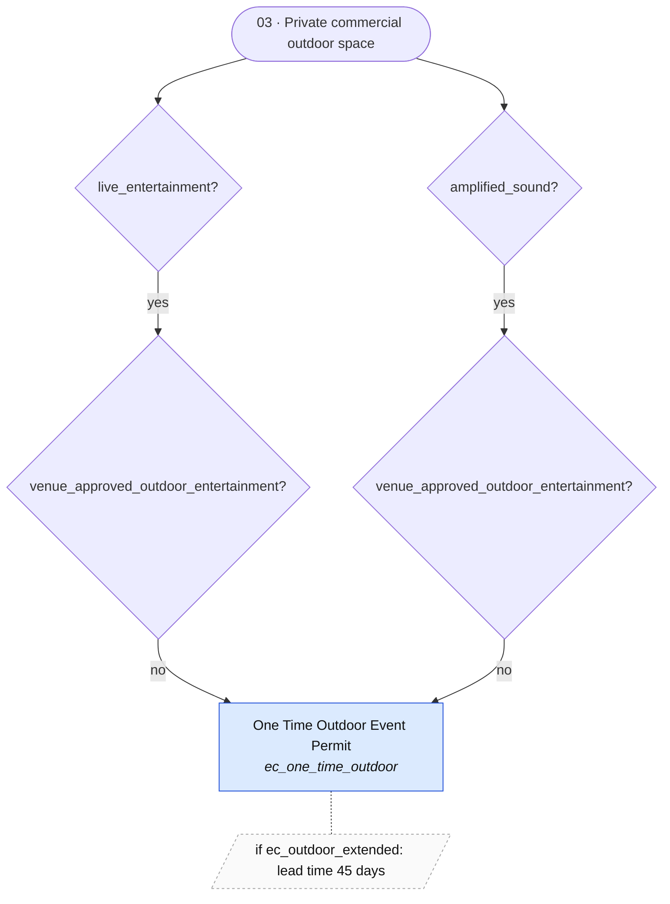

## 04 · Street or sidewalk

[`04_street_or_sidewalk.mmd`](04_street_or_sidewalk.mmd)

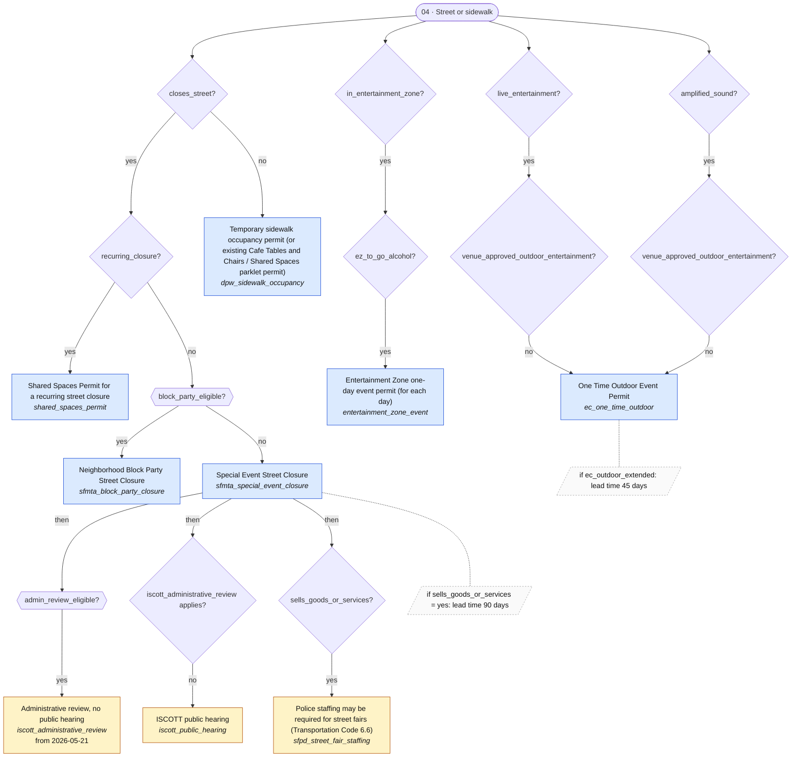

## 05 · City park

[`05_city_park.mmd`](05_city_park.mmd)

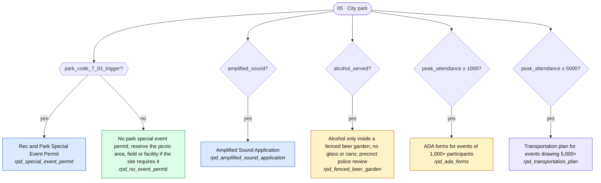

## 06 · Port and Treasure Island

[`06_port_and_treasure_island.mmd`](06_port_and_treasure_island.mmd)

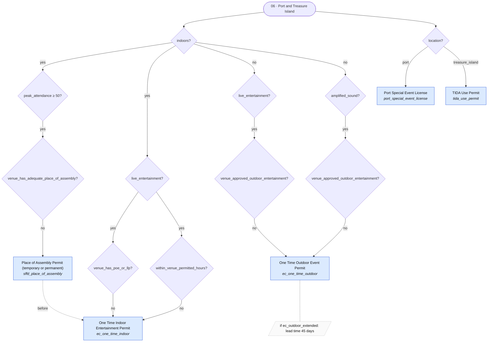

## 07 · Federal land

[`07_federal_land.mmd`](07_federal_land.mmd)

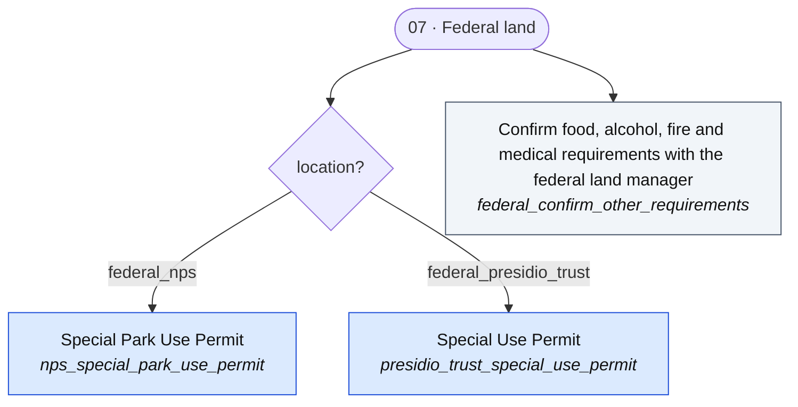

## 08a · Food and drink

[`08a_food_and_drink.mmd`](08a_food_and_drink.mmd)

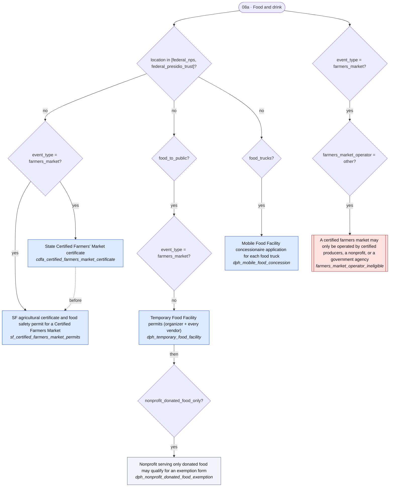

## 08b · Alcohol

[`08b_alcohol.mmd`](08b_alcohol.mmd)

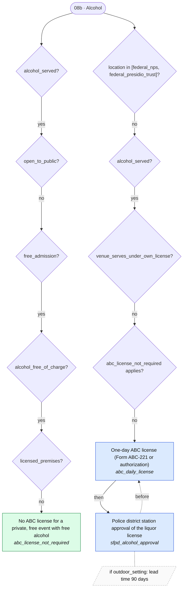

## 08c · Fire and structures

[`08c_fire_and_structures.mmd`](08c_fire_and_structures.mmd)

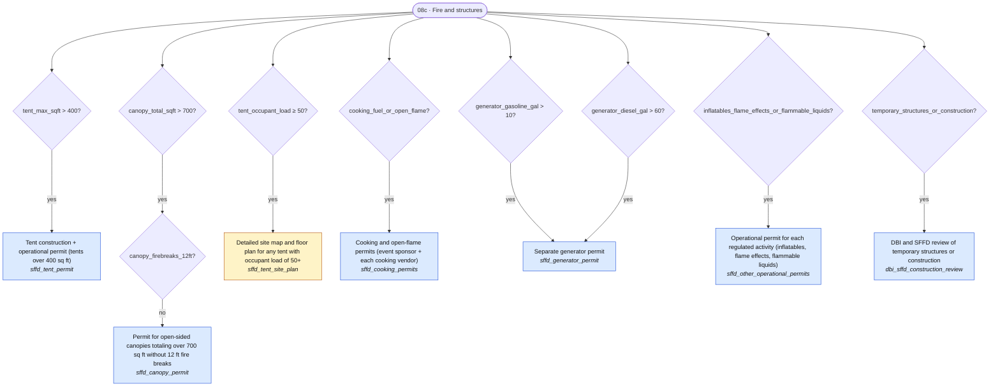

## 08d · Crowd size

[`08d_crowd_size.mmd`](08d_crowd_size.mmd)

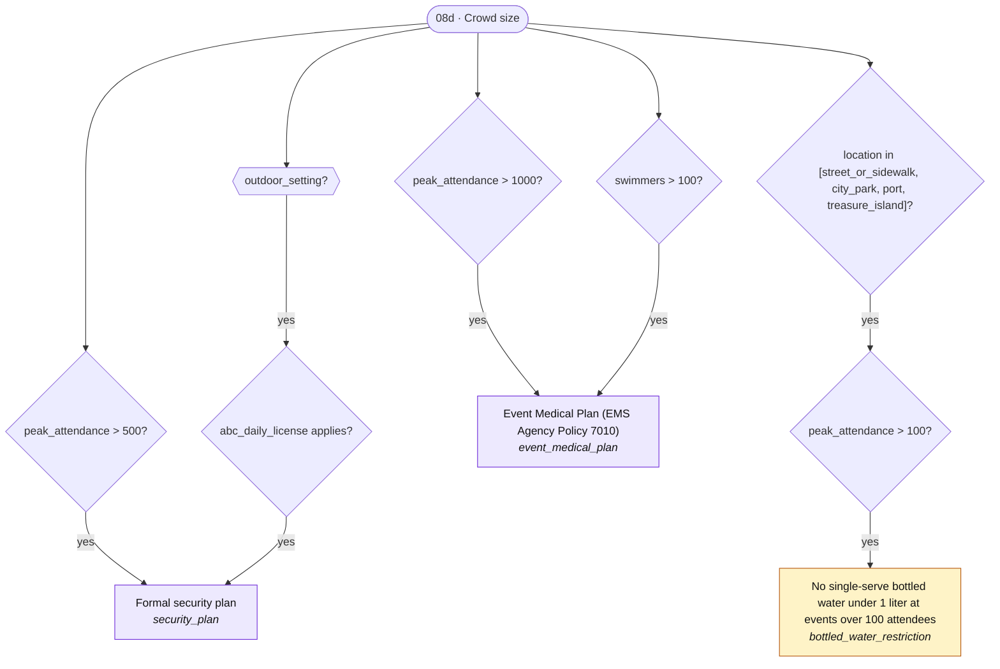

## Macro · admin_review_eligible

[`macro_admin_review_eligible.mmd`](macro_admin_review_eligible.mmd)

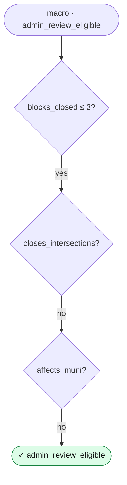

## Macro · block_party_eligible

[`macro_block_party_eligible.mmd`](macro_block_party_eligible.mmd)

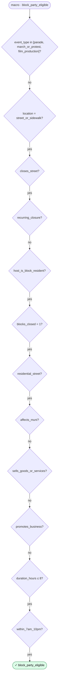

## Macro · ec_outdoor_extended

[`macro_ec_outdoor_extended.mmd`](macro_ec_outdoor_extended.mmd)

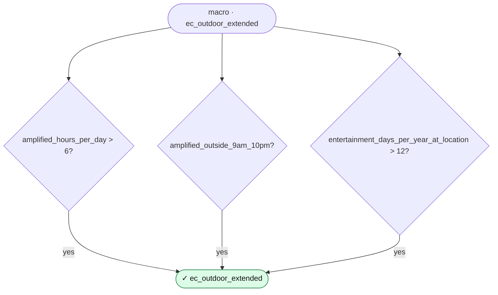

## Macro · outdoor_setting

[`macro_outdoor_setting.mmd`](macro_outdoor_setting.mmd)

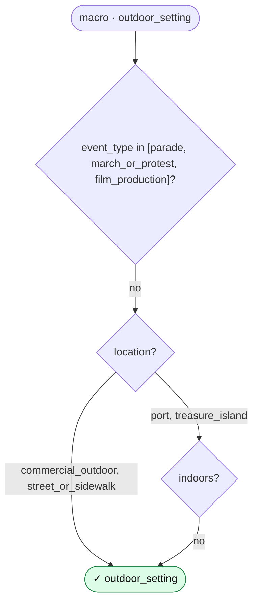

## Macro · park_code_7_03_trigger

[`macro_park_code_7_03_trigger.mmd`](macro_park_code_7_03_trigger.mmd)

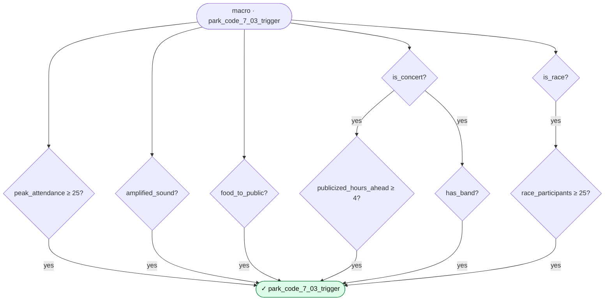
